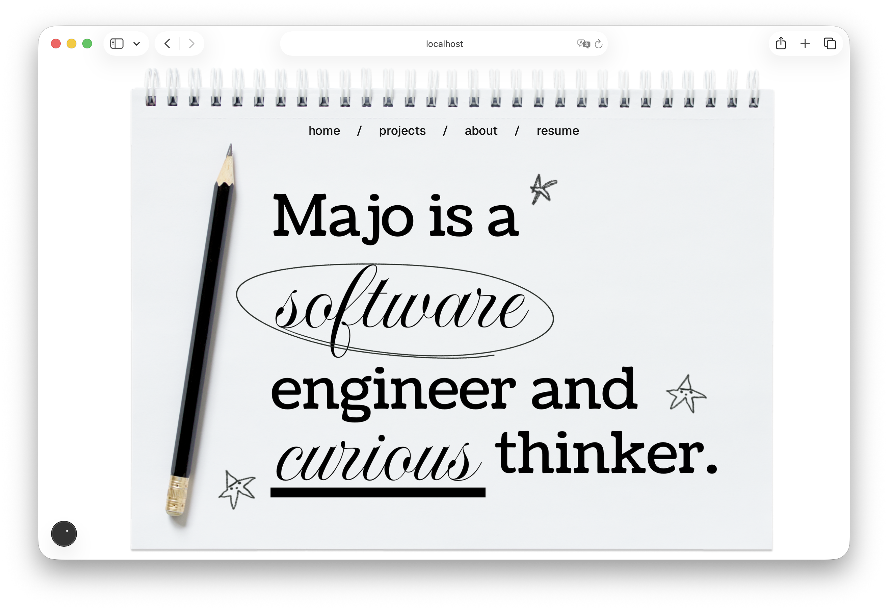

<h1>   welcome to my portfolio</h1>

this is my portfolio website, i’m using this project to practice, explore design, and document what i learn along the way !

 

## 🌐 live site 
**[mariaajoseefi.github.io](https://mariaajoseefi.github.io)**
 
this repo is the full-stack codebase, the deployed version lives in the [github pages repo !](https://github.com/mariaajoseefi/mariaajoseefi.github.io)

## ✏️ tech stack
 
### frontend
| tech | purpose |
|------|---------|
| **next.js** (app router) | framework & routing |
| **typescript** | type safety |
| **tailwind css** | styling |

### backend *(coming soon)*
| tech | purpose |
|------|---------|
| **python** | backend language |
| **fastAPI** | API framework |

## ⏰ project status

this project is **under construction**

future plans include:
- a backend API built with python
- better animations and interactions

## 📒 learning log
 
i'm keeping a running log of things i learn while building this project
 
check out [`LEARNING.md`!](./LEARNING.md)

  made with curiosity and a lot of coffee

